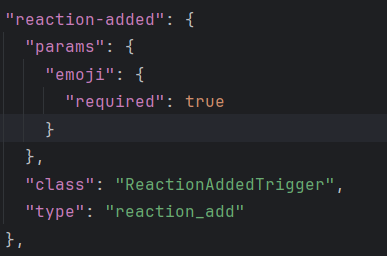
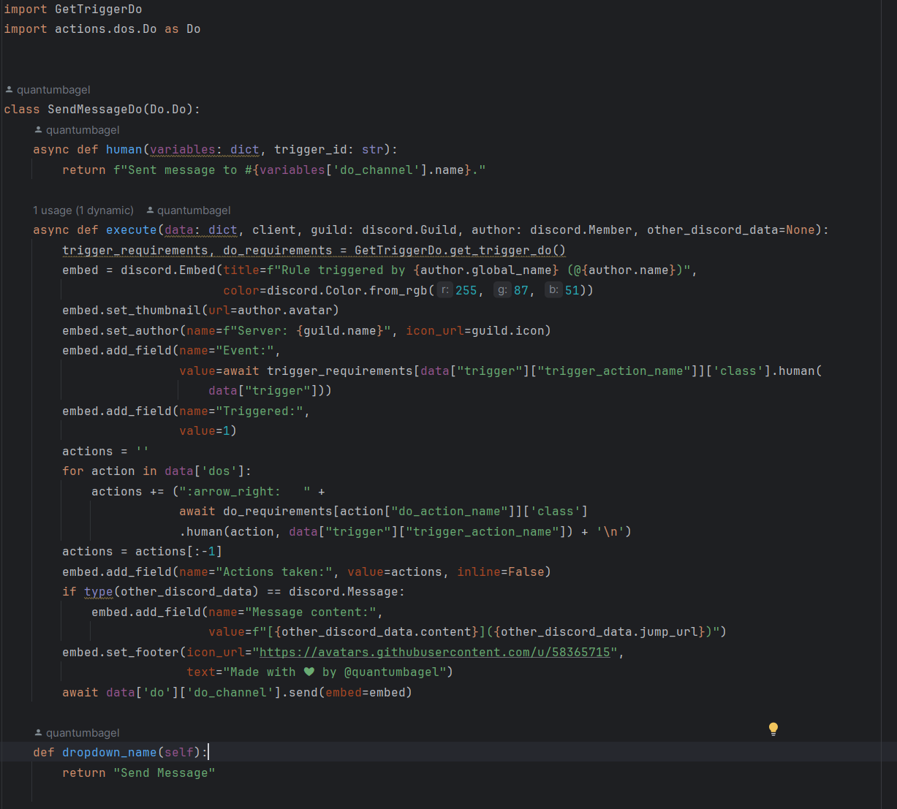
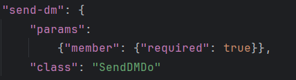

# Triggered - A IFTTT discord bot

This README will attempt to do the following:

* Describe what Triggered is
* How to set it up locally as your own discord bot
* Contribution guidelines / API reference
* How to use the bot itself
* TODOS (things I want to add to the bot that aren't currently present)

**Please note this README is out of date**

Alright, let's get started!

## What is Triggered?

Triggered is a Discord bot that you can configure to take an input action 
(like a message being sent with certain text, or a member joining a certain voice channel) and perform output actions 
(like sending a DM with information on what happened).
I have tried to make this bot extensible (so it's very easy to add your own input and output actions).

## How do I set it up locally?

1. Go to [Discord's developer website](https://discord.com/developers) and sign in with your Discord account.
2. Create a bot [here's an official tutorial](https://discord.com/developers/docs/getting-started)
3. Clone this repository.
4. Install dependencies (`pip install -r requirements.txt`))
5. Get your bot secret, create a file named `key`, and paste your token in.
6. Add your bot to your server and enjoy (`python3 bot.py`)!

Please open an issue if you're having any trouble setting this up.

## API Reference

There are two types of actions - input actions (triggers) and output actions (dos).

### Implementing a Trigger

Here's an example Trigger:

As you can see, you have to

* Inherit from `actions.triggers.Trigger`
* Implement three functions:
* human - Return a human-readable representation of this trigger based off the `variables` dictionary
* is_valid - Determine if the trigger has fired based off the input `variables` and other data.
* dropdown_name - Return a string representing the human-readable trigger name to be added to the dropdown in the command tree automatically.

Here's a quick table representing what can be in the `variables` dictionary. NB: *all* of these can be None

| Key                   | Explanation                                                                        |
|-----------------------|------------------------------------------------------------------------------------|
| `trigger_role`        | The `discord.Role` object representing a role in a server                          | 
| `trigger_member`      | The `discord.Member` object representing a member in a server                      |
| `trigger_text`        | Text input to the trigger (limited to 128 chars)                                   |  
| `trigger_emoji`       | A string containing an emoji as input to the trigger                               |
| `trigger_vc`          | A `discord.VoiceChannel` object representing a VC in Discord                       |
| `trigger_action_name` | The ID of the trigger (this is self-referential)                                   |
| `trigger_channel`     | A `discord.TextChannel` object representing a text channel in Discord              |
| `trigger_description` | A string set by the user representing the description of the intent of the trigger |

There are many different types of Triggers - here are the descriptions:

| Type              | Explanation                                                                                                                                                   |
|-------------------|---------------------------------------------------------------------------------------------------------------------------------------------------------------|
| `send_msg`        | This type of event will be triggered when a message is sent. The extra data passed to the trigger will be a `discord.Message` representing this sent message. |
| `vc_join`         | This type of event will be triggered when a member joins a VC. In this case, the `discord.VoiceState` of the player both before and after the player joined.  |
| `vc_leave`        | The same as `vc_join`, but if a member leaves a VC.                                                                                                           |
| `reaction_add`    | This type of event will be triggered when a reaction is added to a message.                                                                                   |
| `reaction_remove` | Like `reaction_add`, but when a reaction is removed.                                                                                                          |
| `member_join`     | This type of event is triggered when a member joins. The extra data provided will be the `discord.Member` object.                                             |
| `member_leave`    | The same as `member_join`, but when a member leaves (or is kicked/banned).                                                                                    |

Now that you've made your shiny new Trigger, you have to add it to `configuration/requirements.json`.

Here's example formatting:

| Type                | Explanation                                                                                                                                                                                              |
|---------------------|----------------------------------------------------------------------------------------------------------------------------------------------------------------------------------------------------------|
| `params` (Optional) | If provided, put a dictionary with the format <argument from the `variables` dictionary minus the `trigger_` at the start>: `{"required": True or False depending on what you want your Trigger to use}` |
| `class`             | A string representing the class that you have defined to handle this trigger.                                                                                                                            |
| `type`              | The type that the Trigger is (i.e. what event type to receive).                                                                                                                                          |

## Implementing a Do

Here's an example Do:

As you can see, you have to

* Inherit from `actions.dos.Do`
* Implement three functions:
* human - Return a human-readable representation of this trigger based off the `data` dictionary
* execute - Execute the `do` based off of several arguments.
* dropdown_name - Return a string representing the human-readable do name to be added to the dropdown in the command tree automatically.

Here's a quick table representing what can be in the `data` dictionary. NB: *all* of these can be None

The `data` dictionary has five key-value pairs:

1. `trigger` - This is identical to the `variables` dictionary from above
2. `dos` - A list of all output actions (notated as below)
3. `do` - A dictionary of only the do that triggered this action (notated as below)
4. `meta` - Currently only has one key-value pair: `author`: the `discord.Member` who created the trigger
5. `tracker` A dictionary of `<member-id>: <quantity of times this trigger was activated by this member>`

| Key              | Explanation                                                                   |
|------------------|-------------------------------------------------------------------------------|
| `do`             | The `discord.Role` object representing a role in a server                     | 
| `do_member`      | The `discord.Member` object representing a member in a server                 |
| `do_text`        | Text input to the trigger (limited to 128 chars)                              |  
| `do_emoji`       | A string containing an emoji as input to the do                               |
| `do_vc`          | A `discord.VoiceChannel` object representing a VC in Discord                  |
| `do_action_name` | The ID of the do (this is self-referential)                                   |
| `do_channel`     | A `discord.TextChannel` object representing a text channel in Discord         |
| `do_description` | A string set by the user representing the description of the intent of the do |

Now that you've made your Do, you have to add it to `configuration/requirements.json` (like your Trigger)

Here's example formatting:

| Type                | Explanation                                                                   |
|---------------------|-------------------------------------------------------------------------------|
| `params` (Optional) | Similar behavior as `params` from Trigger                                     |
| `class`             | A string representing the class that you have defined to handle this trigger. |

## Contribution Guidelines

So, you've made some Triggers and Dos and you like them and want to share them and maybe even get them included in the main bot!

Open a pull request explaining 
* what your triggers/dos do
* why they should be added
* confirming that you have extensively tested for bugs and hardened your code

Your contribution is appreciated!

## How do you actually use the bot?

NB: [] = required, {} = not required

### /triggered new \[name\] \[trigger\] {description} {trigger_role} {trigger_member} {trigger_text} {trigger_emoji} {trigger_vc} {trigger_channel}

Create a new empty Trigger with id [name], type [trigger] and other arguments as detailed above.

### /triggered add \[trigger_name\] \[do\] \[do_name\] {description} {do_role} {do_member} {do_text} {do_emoji} {do_vc} {do_channel}

Add a Do to an existing Trigger with id [trigger_name], type [do] id for the do [do_name], and other arguments as detailed above.

### /triggered view \[mode\] {query}

There are three modes for this command.

* Search - search existing triggers in this server for `query`
* View - view information about the trigger with id `query`
* List all - List all available triggers in this server

### /triggered delete \[to_delete\] \[trigger_name\] {do_name}

There are two modes for this command.

* Trigger - delete the Trigger with id `trigger_name`
* Do - delete the Do with id `do_name` inside the trigger with id `trigger_name`

## TODOS to v1.0 (in order of priority)

* ~~Better in-app help / descriptions of arguments~~
* ~~Use embeds every time the bot responds~~
* Multithreading do/trigger execution to prevent malicious code from blocking main thread (not going to do)
* ~~Certain type inheritance for dos~~
* update README with better explanations
* A "periodic" trigger type that runs every so often
* ~~Better permission handling than current system~~
* Dockerfile
* Complete _/triggered configure_
* More trigger types (like message-edit or AutoMod related things) (may remove)
* More Dos
* Auto-flagging / storage of consistently long-running Triggers/Dos (:/)

That's all! :D
